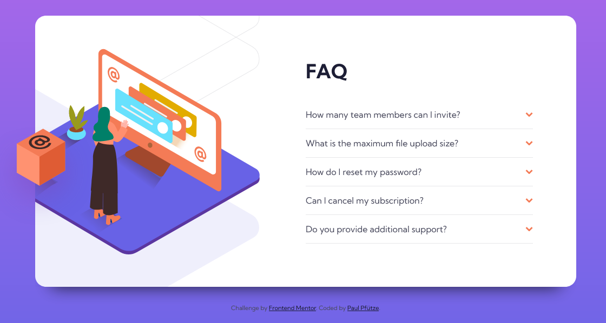

# Frontend Mentor - FAQ accordion card solution

This is a solution to the [FAQ accordion card challenge on Frontend Mentor](https://www.frontendmentor.io/challenges/faq-accordion-card-XlyjD0Oam).

## Table of contents

- [Overview](#overview)
  - [The challenge](#the-challenge)
  - [Screenshot](#screenshot)
  - [Links](#links)
- [My process](#my-process)
  - [Built with](#built-with)
  - [What I learned](#what-i-learned)
- [Author](#author)
- [Acknowledgments](#acknowledgments)

## Overview

### The challenge

Users should be able to:

- View the optimal layout for the component depending on their device's screen size
- See hover states for all interactive elements on the page
- Hide/Show the answer to a question when the question is clicked

### Screenshot




### Links
**TBD**
<!---
- Solution URL: [Add solution URL here](https://your-solution-url.com)
- Live Site URL: [Add live site URL here](https://your-live-site-url.com)
-->
## My process

### Built with

- Semantic HTML5 markup
- CSS custom properties
- Flexbox
- CSS Grid
- Mobile-first workflow

### What I learned
- With a negative spread-radius you can have a box-shadow only on one side.
```css
box-shadow: 0 30px 30px -30px var(--clr-txt-very-dark-blue);
```
- You can use the details-tag to create a NoJS-Accordion
- To create an arrow, like in the accordion, you could use a pseudo-element which is an empty box with a border on only 2 sides and tilt it slightly. In this project, the arrow was already provided.
- To create and open/close animation on the details-tag you can use a margin-bottom with a transition
- transitions in general open crazy possibilities for interactivity, especially the timing-functions
- To hide overflow of an absolute-positioned element, the parent needs:
```css
position: relative;
overflow: hidden;
```

## Author

- Frontend Mentor - [@SutonToch](https://www.frontendmentor.io/profile/SutonToch)

## Acknowledgments

- An anonymous soul of the internet that gave me the idea to use the details-tag for the accordion. I can't for the life of me find the website again. Thank you, whoever you are o7.

